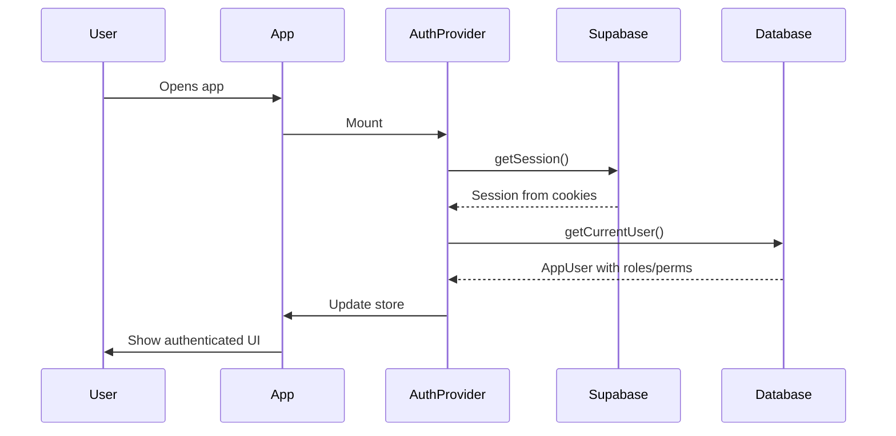

# Authentication System Documentation

## Overview

This project uses **Supabase Auth** with **cookie-based session management**. Tokens are stored in cookies (not localStorage), enabling SSR and preventing logout on page refresh.

## Architecture

### Key Components

1. **Supabase Client** (`src/lib/supabase/client.ts`)
   - Global singleton instance
   - Cookie-based storage
   - Auto-refresh enabled
   - PKCE flow for security

2. **Auth Provider** (`src/providers/auth-provider.tsx`)
   - Listens to Supabase auth events
   - Updates Zustand store
   - Loads user profile from database

3. **Middleware** (`src/middleware.ts`)
   - Protects routes
   - Validates roles and permissions
   - Refreshes session cookies

4. **Auth Store** (`src/stores/auth.store.ts`)
   - Zustand store for auth state
   - Minimal persistence (only OTP flow data)

## How It Works

### Session Persistence

```
┌─────────────────────────────────────────┐
│  Supabase automatically handles:        │
│  ✓ Token storage in cookies             │
│  ✓ Auto-refresh before expiry           │
│  ✓ Cross-tab synchronization            │
│  ✓ Session restoration on page load     │
└─────────────────────────────────────────┘
```

**Why no logout on refresh?**

1. Supabase stores tokens in **HTTP-only cookies**
2. Cookies persist across page reloads
3. On app mount, `AuthProvider` calls `getSession()` which reads from cookies
4. User stays logged in ✅

### Auth Flow



### Auth Events

The AuthProvider listens to these Supabase events:

| Event | Action |
|-------|--------|
| `SIGNED_IN` | Store user, load profile |
| `TOKEN_REFRESHED` | Update user/session (no profile reload) |
| `USER_UPDATED` | Update user, reload profile |
| `SIGNED_OUT` | Clear store |

### Middleware Protection

```typescript
// Routes are configured in src/config/routes.config.ts

Route Types:
- public       → Anyone can access
- auth         → Only unauthenticated (login/signup)
- onboarding   → Authenticated, may not have store
- protected    → Authenticated with active store
- role-based   → Specific roles/permissions required
```

## Usage Examples

### Client Component

```tsx
"use client";

import { useAuth } from "@/hooks/use-auth";

export function MyComponent() {
  const { authUser, appUser, isAuthenticated } = useAuth();

  if (!isAuthenticated) {
    return <div>Please log in</div>;
  }

  return <div>Welcome {appUser?.fullName}</div>;
}
```

### Server Component

```tsx
import { createServerClient } from "@/lib/supabase/server";

export default async function ServerPage() {
  const supabase = await createServerClient();
  const { data: { user } } = await supabase.auth.getUser();

  if (!user) {
    redirect("/login");
  }

  return <div>Server: {user.email}</div>;
}
```

### Role-Based Access

```tsx
import { RoleGuard } from "@/components/guards/role-guard";

export function AdminPanel() {
  return (
    <RoleGuard allowedRoles={["super_admin", "store_admin"]}>
      <div>Admin content</div>
    </RoleGuard>
  );
}
```

### Permission Check

```tsx
import { usePermission } from "@/hooks/use-permission";

export function InventoryButton() {
  const { hasPermission } = usePermission();

  if (!hasPermission("manage_inventory")) {
    return null;
  }

  return <button>Manage Inventory</button>;
}
```

## Configuration

### Environment Variables

```bash
NEXT_PUBLIC_SUPABASE_URL=https://your-project.supabase.co
NEXT_PUBLIC_SUPABASE_ANON_KEY=your-anon-key
```

### Auth Config

Located in `src/config/auth.config.ts`:

```typescript
export const AUTH_CONFIG = {
  refreshCheckIntervalMs: 5 * 60 * 1000,  // 5 minutes
  refreshBeforeExpiryMinutes: 10,
  inactivityTimeoutMinutes: 0,  // Disabled
  enableMultiTabSync: true,
};
```

### Route Config

Located in `src/config/routes.config.ts`:

```typescript
{
  path: "/admin/*",
  type: "role-based",
  allowedRoles: ["super_admin"],
  redirect: {
    unauthenticated: "/login",
    unauthorized: "/unauthorized"
  }
}
```

## Troubleshooting

### Issue: User logged out on refresh

**Cause:** Session not being read from cookies

**Solution:**
1. Check cookies in DevTools → Application → Cookies
2. Look for `sb-*-auth-token` cookies
3. Ensure Supabase client has `persistSession: true`
4. Verify `AuthProvider` calls `getSession()` on mount

### Issue: Infinite loop / Maximum update depth

**Cause:** Creating new Supabase client instances in render

**Solution:**
- Use the **singleton pattern** in `client.ts`
- Don't include `supabase` in dependency arrays
- Auth state changes should not trigger re-initialization

### Issue: Middleware blocks authenticated users

**Cause:** Middleware not reading session correctly

**Solution:**
- Middleware uses `createServerClient` with cookie access
- Calls `getUser()` not `getSession()` (server-validated)
- Check route config in `routes.config.ts`

## Security Best Practices

✅ **DO:**
- Use `getUser()` in middleware (validates with auth server)
- Store tokens in cookies (HTTP-only when possible)
- Check permissions on both client and server
- Use RLS (Row Level Security) in Supabase

❌ **DON'T:**
- Use `getSession()` in middleware (not validated)
- Store tokens in localStorage (XSS vulnerable)
- Rely only on client-side checks
- Hardcode access rules in components

## Additional Resources

- [Supabase Auth Docs](https://supabase.com/docs/guides/auth)
- [Next.js Middleware](https://nextjs.org/docs/app/building-your-application/routing/middleware)
- [Cookie-based Sessions](https://supabase.com/docs/guides/auth/server-side/nextjs)
